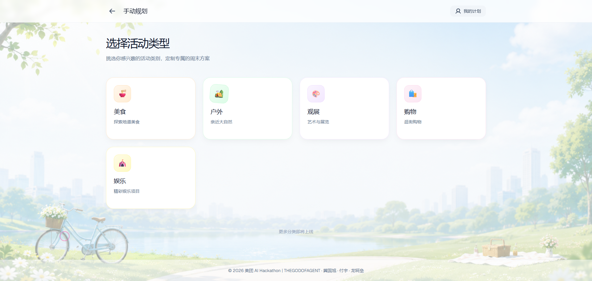
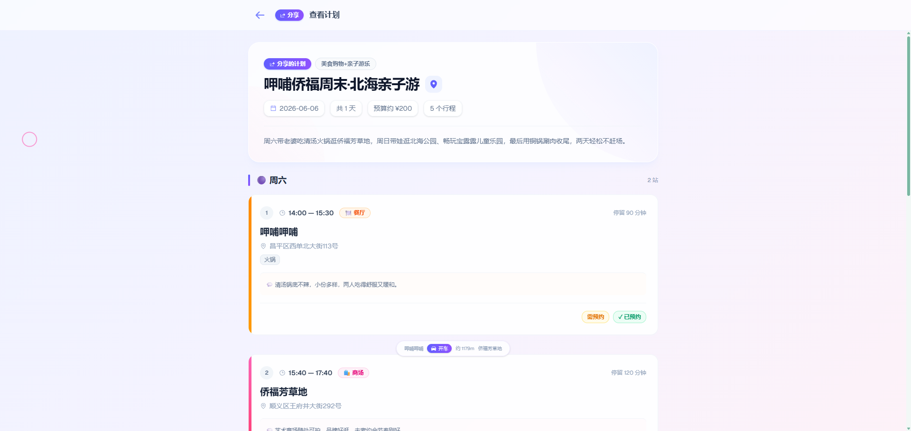

# LeisureAgent

本地场景短时活动规划与执行 Agent —— 接受自然语言输入，输出可执行的活动方案并自动完成下单/预订。

## 场景示例

> "今天下午是空的，想和老婆孩子出去玩几个小时，别离家太远，帮我安排一下。"
>
> "周六想跟老婆吃火锅然后逛商场，周日带孩子去公园、游乐园，再吃个饭。"

Agent 全自动完成从理解需求到预约执行的完整闭环。**端到端耗时不到 2 分钟。**

## 核心功能

| 功能 | 说明 |
|------|------|
| 🧠 **智能规划** | 自然语言输入，AI 自动解析场景（亲子/朋友/情侣）、人数、偏好、预算等约束，生成完整行程方案 |
| 🔍 **多类搜索** | 覆盖餐厅、商场、游乐园、户外景点、展馆五类场所，支持按菜系、距离、价格、排队时间等维度筛选 |
| 📋 **方案编排** | 活动→缓冲→用餐的时序编排，支持多日拆分，每项含时间、费用、出行方式、备注说明 |
| ⚡ **一键预约** | 方案确认后一键执行全部预约，自动跳过无需预约项，容量不足自动尝试替代方案 |
| 💬 **交互式修订** | 支持自然语言反馈修改（"换一家近的"、"太贵了"、"不去游乐园了"），最多 3 轮迭代 |
| 🗺️ **地图视图** | 方案地点可视化，直观查看各站点的空间分布 |
| 📤 **分享方案** | 生成分享链接与文案，好友可直接查看只读版方案 |
| 📜 **会话管理** | 多会话支持，历史会话随时回看和恢复 |
| 🛡️ **智能降级** | LLM 不可用时自动切换规则引擎，核心功能不中断 |
| 🔒 **输入安全** | 中英文双语 prompt injection 检测，控制字符与零宽字符清洗 |

## 端到端体验

从输入一行自然语言到拿到完整可执行方案并完成全部预约，**全程不超过 2 分钟**：

```
用户输入 "下午带老婆孩子出去玩"
  ↓  10s  意图分类 + 需求解析（场景/偏好/约束）
  ↓  50s  候选搜索 + 方案编排（5 类场所 × 多维约束）
  ↓  20s  方案持久化 + 时间线展示
  ↓  20s  一键确认 → 逐项原子预约 → 结果汇总
  ↓
✅ 预约完成，分享链接生成
```

## 项目展示

**首页**


**分类板块**



**Agent 生成计划并预约**


**AI 一键规划页面**


**意图分类——超出领域拒绝**


**地图视图**


**分享计划**


**具体活动查询**


**分享详情页**



## 技术栈

### 前端
| 切面 | 技术组件 | 推荐版本 | 核心作用 |
|------|----------|----------|----------|
| 框架 | React | 19.0.0 | 构建 Web UI 交互界面 |
| 构建工具 | Vite | 6.0.0 | 极速的前端构建工具 |
| 语言 | TypeScript | 5.5.0 | 类型安全，减少前端 Bug |
| UI 库 | Tailwind CSS | 4.0.0 | 快速编写精美、响应式的 UI |
| 组件库 | Shadcn/ui / Ant Design | 最新版 | 现成的组件库（对话框、卡片、时间轴） |

### 后端
| 切面 | 技术组件 | 推荐版本 | 核心作用 |
|------|----------|----------|----------|
| 语言 | Python | 3.12 | AI 编程首选语言，生态最成熟 |
| Web 框架 | FastAPI | 0.136.1 | 异步高性能 Web 框架，自动生成 Swagger 文档 |
| 数据校验 | Pydantic | 2.9.0 | 用于 Agent 输入输出的严格数据格式校验 |
| 测试框架 | Pytest | 9.0.3 | 用于接口测试 |

### Agent
| 切面 | 技术组件 | 推荐版本 | 核心作用 |
|------|----------|----------|----------|
| 编排框架 | LangGraph | 最新版 | 构建带状态循环、复杂规划逻辑的 Agent |

### 存储
| 切面 | 技术组件 | 推荐版本 | 核心作用 |
|------|----------|----------|----------|
| 数据库 | SQLite | Python 内置 | 零配置轻量级数据库，用于持久化 Mock 数据和订单状态 |

## 项目结构

```
├── backend/
│   └── python/                  # Python + LangGraph + FastAPI
├── frontend/                    # React + Vite 前端
├── design/                      # 设计文档
└── .claude/                     # Claude Code 配置
```

## 快速开始

### 前端
```bash
cd frontend
npm install
npm run dev
```

### 后端
```bash
cd backend/python
pip install -r requirements.txt
uvicorn app.main:app --reload --port 8000
```

## 交付目标

1. Web UI —— 移动端优先的聊天式交互界面
2. 完整 Tool 实现代码 —— 含 Mock API 调用
3. 设计文档 —— Planning 策略、工具调用链路、异常处理机制
