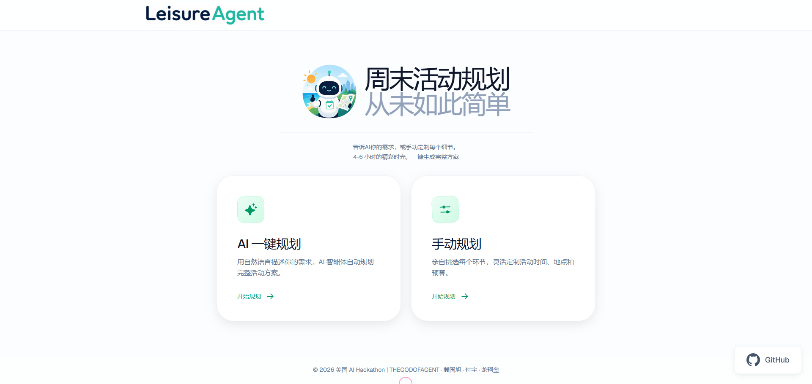
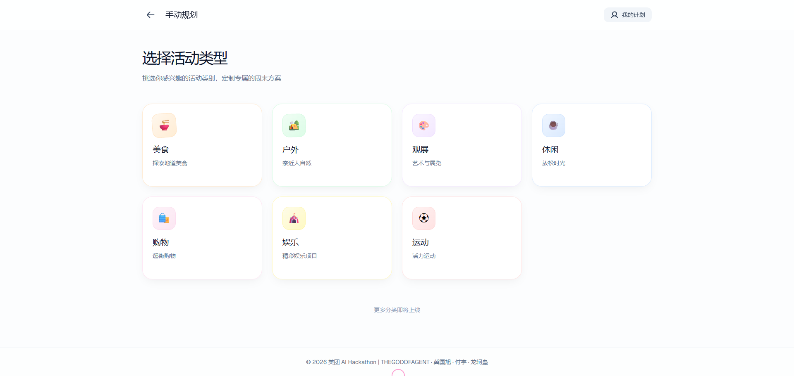

# LeisureAgent

本地场景短时活动规划与执行 Agent —— 接受自然语言输入，输出可执行的活动方案并自动完成下单/预订。

## 场景示例

> "今天下午是空的，想和老婆孩子出去玩几个小时，别离家太远，帮我安排一下。"

Agent 会在几分钟内完成：
1. 规划 4-6 小时的综合方案（去哪玩 → 去哪吃 → 额外活动）
2. 查餐厅是否有位置、是否需要排队
3. 安排吃喝玩乐的可执行方案
4. 一键下单/预约/配送

## 项目展示

**项目展示**



**分类板块**



## 技术栈

### 前端
| 切面 | 技术组件 | 推荐版本 | 核心作用 |
|------|----------|----------|----------|
| 框架 | React | 19.0.0 | 构建 Web UI 交互界面 |
| 构建工具 | Vite | 6.0.0 | 极速的前端构建工具 |
| 语言 | TypeScript | 5.5.0 | 类型安全，减少前端 Bug |
| UI 库 | Tailwind CSS | 4.0.0 | 快速编写精美、响应式的 UI |
| 组件库 | Shadcn/ui / Ant Design | 最新版 | 现成的组件库（对话框、卡片、时间轴） |

### 后端
| 切面 | 技术组件 | 推荐版本 | 核心作用 |
|------|----------|----------|----------|
| 语言 | Python | 3.12 | AI 编程首选语言，生态最成熟 |
| Web 框架 | FastAPI | 0.136.1 | 异步高性能 Web 框架，自动生成 Swagger 文档 |
| 数据校验 | Pydantic | 2.9.0 | 用于 Agent 输入输出的严格数据格式校验 |
| 测试框架 | Pytest | 9.0.3 | 用于接口测试 |

### Agent
| 切面 | 技术组件 | 推荐版本 | 核心作用 |
|------|----------|----------|----------|
| 编排框架 | LangGraph | 最新版 | 构建带状态循环、复杂规划逻辑的 Agent |

### 存储
| 切面 | 技术组件 | 推荐版本 | 核心作用 |
|------|----------|----------|----------|
| 数据库 | SQLite | Python 内置 | 零配置轻量级数据库，用于持久化 Mock 数据和订单状态 |

## 项目结构

```
├── backend/
│   └── python/                  # Python + LangGraph + FastAPI
├── frontend/                    # React + Vite 前端
├── design/                      # 设计文档
└── .claude/                     # Claude Code 配置
```

## 快速开始

### 前端
```bash
cd frontend
npm install
npm run dev
```

### 后端
```bash
cd backend/python
pip install -r requirements.txt
uvicorn app.main:app --reload --port 8000
```

## 交付目标

1. Web UI —— 移动端优先的聊天式交互界面
2. 完整 Tool 实现代码 —— 含 Mock API 调用
3. 设计文档 —— Planning 策略、工具调用链路、异常处理机制
