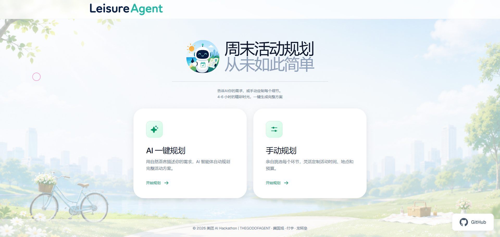
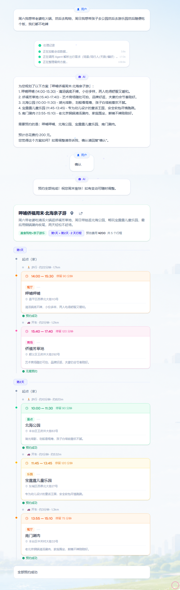
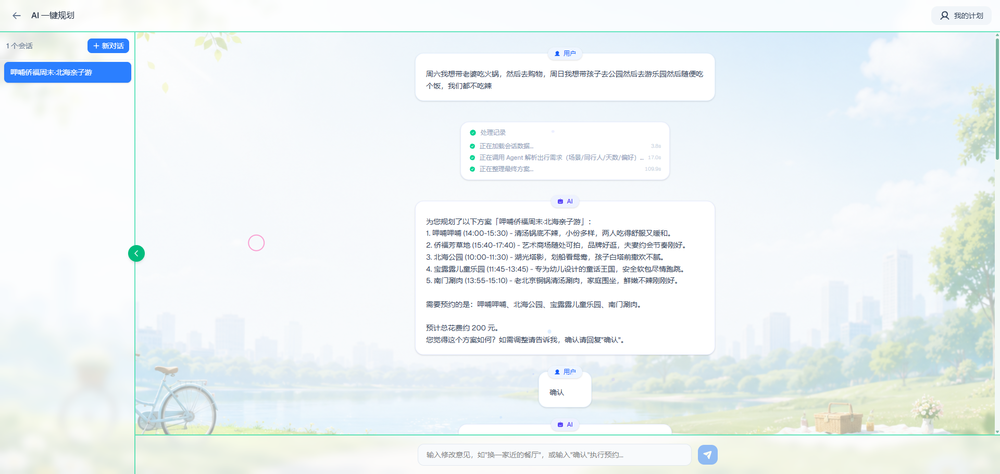
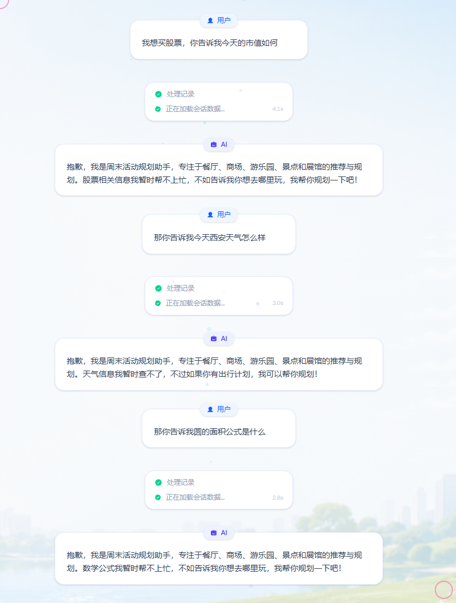
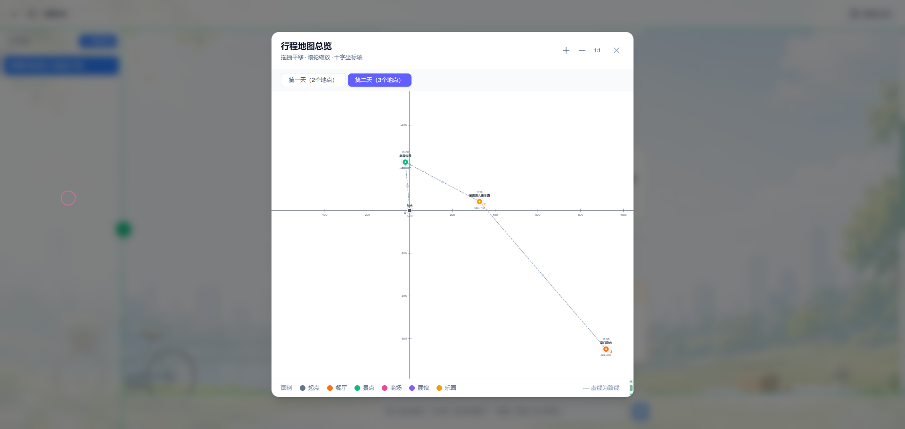
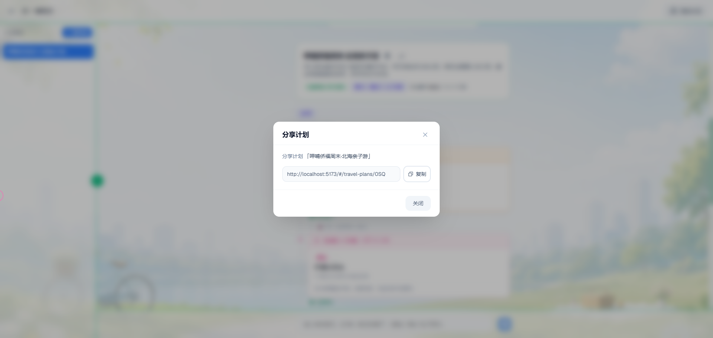

<div align="center">


# LeisureAgent

**AI-Powered Weekend Activity Planner — Plan & Book in Under 2 Minutes**

[](https://www.python.org/)
[](https://fastapi.tiangolo.com/)
[](https://react.dev/)
[](https://www.typescriptlang.org/)
[](https://langchain-ai.github.io/langgraph/)
[](https://github.com/MOOSTTAR/LeisureAgent/stargazers)
[](LICENSE)
[](https://visitorbadge.io/status?path=MOOSTTAR%2FLeisureAgent)
[](https://github.com/MOOSTTAR/LeisureAgent/pulls)

[中文文档](README.md) •
[Features](#features) •
[Getting Started](#getting-started) •
[Screenshots](#screenshots) •
[Architecture](#architecture)

</div>

---

## What is LeisureAgent?

LeisureAgent is a **local-scene short-term activity planning & execution agent**. Describe your weekend afternoon in natural language, and it handles the rest:

1. **Understands** your intent — scenario (family/friends/couple), party size, cuisine, budget, distance
2. **Searches** across 5 venue types — restaurants, malls, amusement parks, scenic spots, exhibition halls (250+ venues)
3. **Composes** a time-optimized itinerary — play → buffer → dining, with multi-day support
4. **Books** everything with one click — reservations, tickets, all at once with auto-retry on failure

All under 2 minutes. No manual searching, no tab-switching.

> *"This afternoon I want to go out with my wife and kid for a few hours, don't go too far."*
>
> *"Saturday — hotpot with my wife then shopping. Sunday — take the kids to a park and amusement park, then dinner."*

---

## Features

| | Feature | Description |
|---|---------|-------------|
| 🧠 | **AI Planning** | LLM parses intent — scenario, constraints, preferences — and generates a full itinerary |
| 🔍 | **Multi-Source Search** | 250+ venues across restaurants / malls / parks / exhibitions / amusement parks |
| 📋 | **Smart Composition** | Time-aware scheduling: main activity → buffer → dining, with point-to-point travel time |
| ⚡ | **One-Click Booking** | Atomic reservations with automatic retry and fallback alternatives |
| 💬 | **Interactive Revision** | Natural language feedback — up to 3 revision rounds |
| 🗺️ | **Map View** | All stops visualized on an interactive map with day-based grouping |
| 📤 | **Share** | One-click share link with read-only plan view |
| 🛡️ | **Graceful Degradation** | Full rule-engine fallback when LLM is unavailable |
| 🔒 | **Input Security** | Bilingual prompt injection detection, zero-width char sanitization |

---

## End-to-End Flow

```
User: "Plan an afternoon out with my wife and kid"
  ↓  10s  Intent classification + requirement parsing
  ↓  50s  Candidate search + itinerary composition (5 categories × constraints)
  ↓  20s  Plan persistence + timeline presentation
  ↓  20s  One-click confirmation → atomic bookings → results summary
  ↓
✅ All booked, share link generated
```

---

## Screenshots

<details open>
<summary><b>Homepage</b></summary>
<br/>

</details>

<details open>
<summary><b>AI Planning & Booking</b></summary>
<br/>

</details>

<details open>
<summary><b>Chat Interface</b></summary>
<br/>

</details>

<details open>
<summary><b>Out-of-Domain Guard</b></summary>
<br/>

</details>

<details open>
<summary><b>Map & Share</b></summary>
<br/>


</details>

---

## Tech Stack

### Frontend

| Layer | Technology | Version | Purpose |
|-------|-----------|---------|---------|
| Framework | React | 19.0.0 | Interactive Web UI |
| Build Tool | Vite | 6.0.0 | Fast dev & build |
| Language | TypeScript | 5.5.0 | Type safety |
| CSS | Tailwind CSS | 4.0.0 | Utility-first styling |
| Components | Shadcn/ui / Ant Design | Latest | Dialog, card, timeline components |

### Backend

| Layer | Technology | Version | Purpose |
|-------|-----------|---------|---------|
| Language | Python | 3.12 | AI ecosystem |
| Web Framework | FastAPI | 0.136.1 | Async HTTP + auto Swagger docs |
| Validation | Pydantic | 2.9.0 | Strict Agent I/O schema validation |
| Testing | Pytest | 9.0.3 | API & unit tests |

### Agent

| Layer | Technology | Version | Purpose |
|-------|-----------|---------|---------|
| Orchestration | LangGraph | Latest | Stateful, cyclic Agent workflow |

### Storage

| Layer | Technology | Version | Purpose |
|-------|-----------|---------|---------|
| Database | SQLite | Built-in | Zero-config persistence for mock data & orders |

---

## Project Structure

```
├── backend/
│   └── python/                  # Python + LangGraph + FastAPI
├── frontend/                    # React + Vite frontend
├── design/                      # Design documents
└── .claude/                     # Claude Code configuration
```

---

## Architecture

```
User Input (Natural Language)
        │
        ▼
┌─────────────────────────────────────┐
│          LangGraph Agent             │
│                                      │
│  load_session → classify_intent      │
│       │                              │
│       ├─ casual/out-of-domain → reply│
│       ├─ inquiry → search → present  │
│       ├─ new_plan → analyze → search │
│       │                  │           │
│       │   ┌─ReAct Loop──┐│           │
│       │   │ detect_gaps ││           │
│       │   │  → adjust   ││           │
│       │   └─────────────┘│           │
│       │                  ↓           │
│       │              compose         │
│       │                  │           │
│       │   ┌─P&E Loop───┐│            │
│       │   │ execute    ││            │
│       │   │  → replan  ││            │
│       │   └────────────┘│           │
│       │                  │           │
│       └─ feedback → revise → compose │
│                                      │
│  Tools: search / location / book     │
└──────────────────────────────────────┘
        │
        ▼
┌──────────────┐   ┌──────────────┐
│   FastAPI    │   │  React 19    │
│   + SQLite   │◄──│  + Vite      │
│   + SSE      │   │  + Tailwind  │
└──────────────┘   └──────────────┘
```

---

## Getting Started

### 1. Prerequisites

- **Python** ≥ 3.12
- **Node.js** ≥ 18
- **DeepSeek API Key** (or any OpenAI-compatible key)

### 2. Configure LLM

Copy `.env.example` to `backend/python/.env` and set your API key:

```bash
cp .env.example backend/python/.env
```

#### Option A: System Environment Variable (Recommended)

Set `DEEPSEEK_API_KEY` in your system environment, then reference it in `.env`:

```bash
# backend/python/.env
DEEPSEEK_API_KEY=${DEEPSEEK_API_KEY}   # Reads from system env
```

#### Option B: Write Directly

```bash
# backend/python/.env
DEEPSEEK_API_KEY=sk-xxxxxxxxxxxx       # Your actual key
```

> **Note**: `.env` is git-ignored. The app **refuses to start** without a valid API key and prints setup instructions.

#### Switch Provider

<details>
<summary>OpenAI</summary>

```bash
# backend/python/.env
LLM_PROVIDER=openai
OPENAI_API_KEY=sk-xxxxxxxxxxxx
OPENAI_MODEL=gpt-4o-mini
```
</details>

<details>
<summary>Anthropic Claude</summary>

```bash
# backend/python/.env
LLM_PROVIDER=anthropic
ANTHROPIC_API_KEY=sk-ant-xxxxxxxxxxxx
ANTHROPIC_MODEL=claude-3-5-sonnet-20241022
```
</details>

<details>
<summary>Ollama (local, no API key)</summary>

```bash
# backend/python/.env
LLM_PROVIDER=ollama
OLLAMA_MODEL=qwen2.5:14b
```
</details>

#### Disable LLM (Rule-Engine Only)

```bash
# backend/python/.env
USE_LLM_FOR_INTENT=false
USE_LLM_FOR_PLAN=false
```

### 3. Install Dependencies

```bash
# Backend
cd backend/python
pip install -r requirements.txt

# Frontend
cd frontend
npm install
```

### 4. Initialize Database

The database auto-initializes on first startup with 250+ mock venues. To reset:

```bash
cd backend/python
python -c "from app.db.database import reset_db; reset_db()"
```

### 5. Start Services

Start the backend first, then the frontend. The Vite dev server proxies `/api` to the backend automatically.

```bash
# Terminal 1 — Backend
cd backend/python
uvicorn app.main:app --reload --port 8000

# Terminal 2 — Frontend
cd frontend
npm run dev
```

Open `http://localhost:5173` → **AI 一键规划**.

### 6. Run Tests

```bash
cd backend/python
python -m pytest tests/ -v
```

---

## Deliverables

1. **Web UI** — Mobile-first chat interface
2. **Tool Implementation** — Full code with mock API calls
3. **Design Docs** — Planning strategy, tool call chain, exception handling

---

## License

MIT © [MOOSTTAR](https://github.com/MOOSTTAR)
